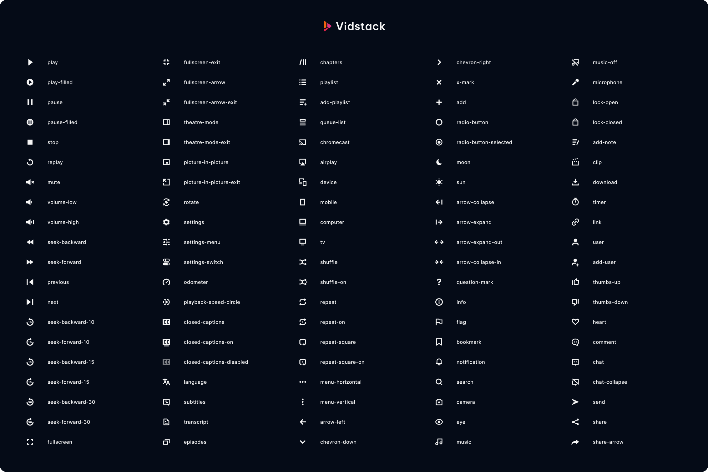

# Media Icons

[![package-badge]][package]
[![discord-badge]][discord]

Media Icons is an open-source and beautifully hand-crafted collection of icons, designed by the
[Vidstack][vidstack] team specifically for building audio and video players. Our icons are bold,
clean, and consistent. All of the icons are free for both personal and commercial use.



## Usage

The icons can be used in any of the following ways:

- [Vidstack Player](#vidstack-player)
- [Web Component](#web-component)
- [JS Frameworks](#js-frameworks)
- [Copy SVG](#copy-svg)
- [Raw SVG](#raw-svg)
- [Raw SVG Paths](#raw-svg-paths)
- [Figma](#figma)

## Vidstack Player

If you're using [Vidstack Player][github-player], you can use the library as follows with HTML or
React.

### HTML

Install the package:

```bash
npm i media-icons@next
```

Register the `<media-icon>` element:

```ts
import "vidstack/icons";
```

Use the element (icons are lazy loaded):

```html
<media-icon type="play"></media-icon>
```

👉 The complete list of icons can be found in our [media icons catalog][catalog].

### React

Install the package:

```bash
npm i media-icons@next
```

Import icons like so:

```ts
import {
  PauseIcon,
  PlayIcon,
  // ...
} from "@vidstack/react/icons";
```

👉 The complete list of icons can be found in our [media icons catalog][catalog].

## Web Component

You can use the `<media-icon>` element to lazy load icons via [NPM](#npm) or [CDN](#cdn).

### NPM

Install the package:

```ts
npm i media-icons@next
```

Register the `<media-icon>` element:

```ts
import "media-icons/element";
```

Use the element (icons are lazy loaded):

```html
<media-icon type="play"></media-icon>
```

👉 The complete list of icons can be found in our [media icons catalog][catalog].

### CDN

Add the following script to the `<head>` of your site:

```html
<script src="https://cdn.vidstack.io/icons" type="module"></script>
```

Use the element (icons are lazy loaded):

```html
<media-icon type="play"></media-icon>
```

👉 The complete list of icons can be found in our [media icons catalog][catalog].

## JS Frameworks

We recommend using [unplugin-icons](https://github.com/antfu/unplugin-icons) as it has many
bundler (Vite/Rollup/Webpack), framework (React/Vue/Preact/Solid/Svelte) and customization
options.

First, install the package:

```bash
npm i media-icons@next
```

Next, you'll need to configure the plugin like so:

```js
import { FileSystemIconLoader } from "unplugin-icons/loaders";

Icons({
  customCollections: {
    media: FileSystemIconLoader("./node_modules/media-icons/raw"),
  },
});
```

Finally, you can import the icons like so:

```js
// Replace {name} with the icon name.
import ... from '~icons/media/{name}';
// Examples
import PauseIcon from '~icons/media/pause';
import PlayIcon from '~icons/media/play';
```

👉 The complete list of icons can be found in our [media icons catalog][catalog].

## Copy SVG

Head over to the [media icons catalog][catalog] on the Vidstack website, search for an icon, copy
the raw SVG, and finally paste it in your project.

## Raw SVG

The raw SVG files can be imported from this package like so:

```js
// Replace {name} with the icon name.
import ... from 'media-icons/raw/{name}.svg';
// Examples
import PauseIcon from 'media-icons/raw/pause.svg';
import PlayIcon from 'media-icons/raw/play.svg';
```

## Raw SVG Paths

The raw SVG paths can be imported from this package like so:

```js
// camelCase variant of the icon name
import { pausePaths, playPaths, ... } from 'media-icons';
```

```js
// All SVG paths (server-side)
import { paths } from "media-icons";

paths.play; // string
paths.pause;
// ...
```

```js
// Dynamically loaded SVG paths (client-side)
import { lazyPaths } from "media-icons";

lazyPaths.play(); // Promise<string>
lazyPaths.pause();
// ...
```

It's expected that the SVG paths are inserted into an `<svg>` element as `innerHTML` with the
following setup:

```html
<svg
  width="32"
  height="32"
  viewBox="0 0 32 32"
  fill="none"
  xmlns="http://www.w3.org/2000/svg"
  aria-hidden="true"
></svg>
```

## Figma

Our media icons are available on Figma! You can get a copy from the [Vidstack community page][figma].

## 📝 License

Media Icons is [MIT licensed](./LICENSE).

[vidstack]: https://vidstack.io
[github-player]: https://github.com/vidstack/player
[catalog]: https://vidstack.io/media-icons
[package]: https://www.npmjs.com/package/media-icons
[package-badge]: https://img.shields.io/npm/v/media-icons/next
[discord]: https://discord.com/invite/7RGU7wvsu9
[figma]: https://www.figma.com/@vidstack
[discord-badge]: https://img.shields.io/discord/742612686679965696?color=%235865F2&label=%20&logo=discord&logoColor=white
